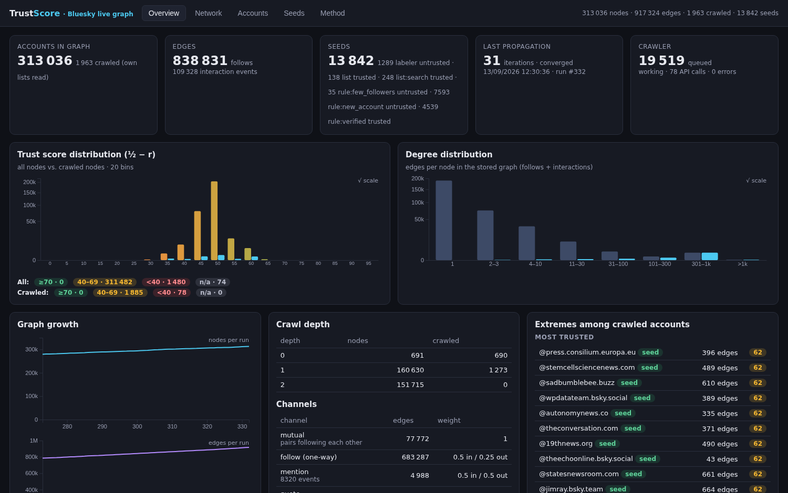
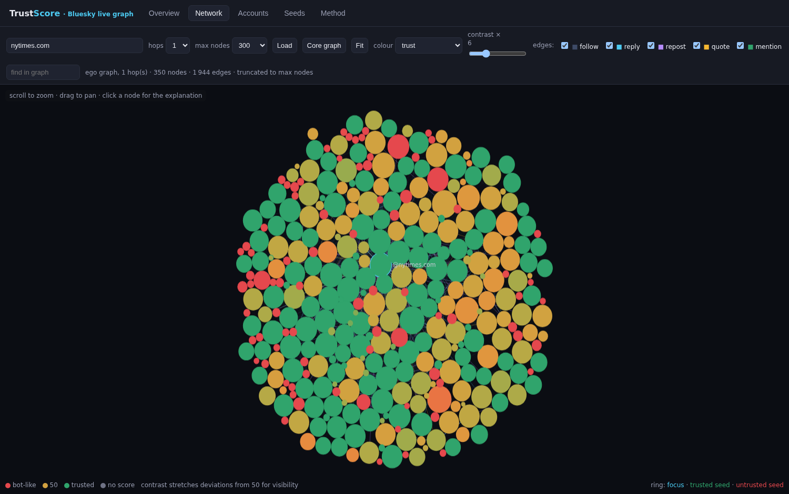

# Trust Score — network-based bot detection, from open datasets to a live Bluesky add-on

A **trust score** for social-media accounts that judges the *source* (profile metadata, position in the
follow/interaction graph, membership in coordinated clusters) rather than the content it posts.

* **Step 1 — open data** (this repo's dashboard): find bots in open, labelled network datasets, define and
  validate the score formula, expose everything in a web dashboard.
* **Step 3 — live add-on** ([`bluesky-addon/`](bluesky-addon/README.md)): the same formula running on a graph
  crawled live from Bluesky's public API, with a score badge next to every account on `bsky.app`.

Design choices, approximations and hard-coded values are documented in [`docs/DESIGN.md`](docs/DESIGN.md) (2 pages).

```
backend/    Python package `trustscore` (loaders, features, local model, propagation, clusters, evaluation, FastAPI)
frontend/   React + TypeScript dashboard (sigma.js network explorer, recharts)
data/raw/   downloaded datasets (cresci-2015 from the Bot Repository, MGTAB from GitHub/Google Drive)
data/processed/<dataset>/   pipeline artifacts served by the API
docs/       DESIGN.md (+ PDF)
mockups/    static browser add-on mock-ups (Reddit, X/Twitter)
bluesky-addon/  live Chrome add-on for bsky.app + d3 dashboard (see bluesky-addon/README.md)
backend/trustscore/bluesky/  crawler, SQLite graph store, scoring and API behind that add-on (port 8010)
screenshots/ images used in this README
```

## Quick start

```bash
# 1. backend environment (uv or plain venv)
cd backend && uv venv --python 3.10 .venv && uv pip install --python .venv/bin/python -e .

# 2. datasets (already downloaded in data/raw; see docs for sources)
#    cresci-2015: https://botometer.osome.iu.edu/bot-repository/datasets/cresci-2015/cresci-2015.csv.tar.gz
#    MGTAB:       https://github.com/GraphDetec/MGTAB (Google Drive link in the README)

# 3. run the pipeline (features -> local model -> propagation -> clusters -> evaluation -> artifacts)
.venv/bin/python scripts/run_pipeline.py cresci-2015      # ~5-10 min, add --skip-sweeps for ~1 min
.venv/bin/python scripts/run_pipeline.py mgtab

# 4. API + dashboard
cd ../frontend && npm install && npm run build           # builds into frontend/dist (served by the API)
cd ../backend && .venv/bin/python scripts/serve.py 8000   # http://127.0.0.1:8000
# (development: `npm run dev` in frontend/ proxies /api to the backend on :8000)

# tests
cd backend && .venv/bin/python -m pytest -q
```

## What the score is

For every account `v`, with `q_v` its prior evidence of being a bot (±½ for labelled seeds, `λ·(p_local − ½)`
from a Random-Forest profile/structure model otherwise) and `P` a row-stochastic matrix over typed,
hub-damped edge channels (mutual follow, follower→followee, followee→follower, mentions, replies, …):

```
r = (1 − α)·q + α·P·r          (unique fixed point, |r| ≤ ½)
trust(v) = ½ − r_v ∈ [0, 1]     (1 = trusted, 0 = bot-like)
```

Channel weights are estimated from the label homophily of seed–seed edges (blended with a hand-set prior).
The dashboard decomposes every score into prior + per-channel + per-neighbour terms, lists the local-model
feature contributions, and shows Leiden communities, dense co-following blocks and creation bursts.

## Screenshots

### Dashboard: metrics (Overview tab)

Out-of-fold ROC AUC / AP / F1 of the trust score against three baselines (local model only, propagation only,
raw uncalibrated trust), ROC curves, the score histogram by label, robustness sweeps (share of labelled seeds,
label noise), the most useful local features and the learned per-channel weights.


MGTAB is the harder, more recent dataset (every account labelled, bots mixed into the genuine population rather
than sitting in separate follower farms): out-of-fold AUC drops to 0.96 and propagation alone is close to useless,
so the score leans on the local model and the learned channel weights.


### Dashboard: network explorer (Network tab)

sigma.js view of the labelled accounts and their neighbourhood, coloured by calibrated trust (red = bot-like,
green = trusted). The three red blobs are the cresci-2015 fake-follower groups, the green mass the genuine
accounts; toggle edge channels, focus on a cluster, search a handle, or click a node for its score decomposition.


On MGTAB there are no separate bot blobs: bot-like accounts (red/amber) are scattered at the fringe of the genuine
communities, which is why the network alone cannot separate them.


### Browser add-on mock-ups (Reddit, X/Twitter)

Static, realistic fakes of what the add-on injects into a Reddit thread (an X/Twitter version is included too),
for the two platforms where no live crawler exists yet: a trust badge next to every username, a popover that
decomposes the score into own evidence, per-channel network terms and cluster membership, and a side card
summarising the page. Numbers are illustrative
but follow the real score's structure — which the Bluesky add-on below now computes for real.
Details in [`mockups/README.md`](mockups/README.md).


To see it, serve the `mockups/` folder (no build step) and open the landing page, which links to both mock-ups and
has a guide with "Show me" buttons for the four example accounts:

```bash
python3 -m http.server 8765 --directory mockups     # then open http://127.0.0.1:8765/index.html
```

Opening `mockups/index.html` directly in a browser (file://) works too.

## Live Bluesky add-on (step 3)

Unlike the mock-ups above, this one is real: no synthetic numbers, no pre-computed dataset. It reads the accounts
visible on a `bsky.app` page, crawls their neighbourhood from the **public** Bluesky API (no login, no API key),
stores the graph in SQLite and runs the step-1 propagation on it.

```bash
cd backend && PYTHONPATH=$PWD .venv/bin/python scripts/serve_bluesky.py 8010
# then chrome://extensions -> Developer mode -> Load unpacked -> pick bluesky-addon/
# dashboard: http://127.0.0.1:8010/addon/dashboard.html
```

**Breadth-first, and cached.** The crawl frontier is a persisted table ordered by `(priority, depth, arrival)`:
accounts on screen go in at priority 0, accounts just below the fold at priority 1, and their neighbours one
level deeper in the background. Every account requested by the page is therefore fully expanded before any
neighbour is touched, the queue survives a restart, and an account already crawled is never fetched again
before its time-to-live expires. Per account: profile, followers, follows, and the last posts, from which
reply / repost / quote / mention edges are extracted.

**Seeds.** Trusted by default: a curated list of ~230 news outlets (validated live against the API), verified
accounts found by actor search, and every account Bluesky reports as verified. Untrusted by default: accounts
created less than 7 days ago, accounts with fewer than 20 followers, and accounts carrying a moderation label
(spam, bot, impersonation, …). Every rule is a switch with an editable threshold, and clicking "Mark trusted /
untrusted" on any account overrides them and re-runs the propagation immediately.

**Dashboard** (`/addon/dashboard.html`, same look as the step-1 dashboard, no build step): score and degree
distributions, band counts, graph growth per run, crawl depth, channel weights, and the extremes among crawled
accounts.



The Network tab lays out an ego graph or the crawled core on canvas; the contrast slider stretches deviations
from 50, since scores concentrate there until seeds reach an account. Below, the neighbourhood of `@nytimes.com`:
the outlet (blue ring, centre) sits in a dense green block of trusted media and journalists, while bot-like
accounts (red) sit at the fringe with few edges. Clicking any node opens the same explanation as the in-page
popover.



Full documentation, API reference and the list of approximations: [`bluesky-addon/README.md`](bluesky-addon/README.md).
