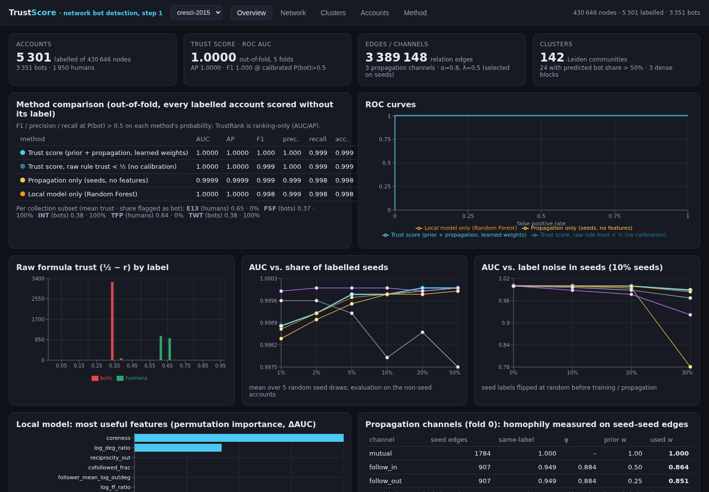
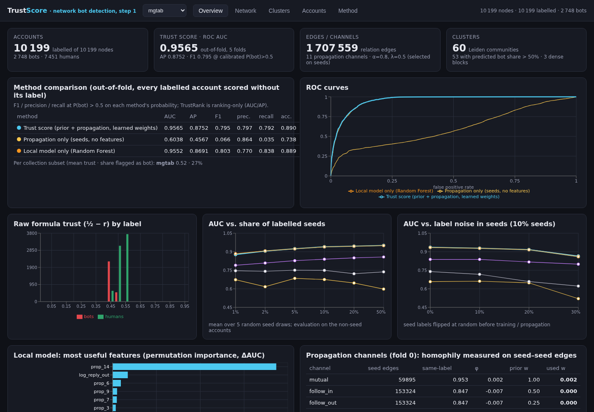
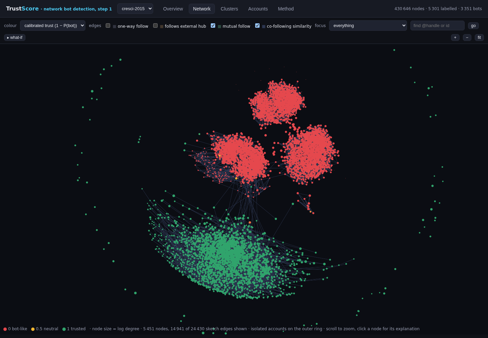
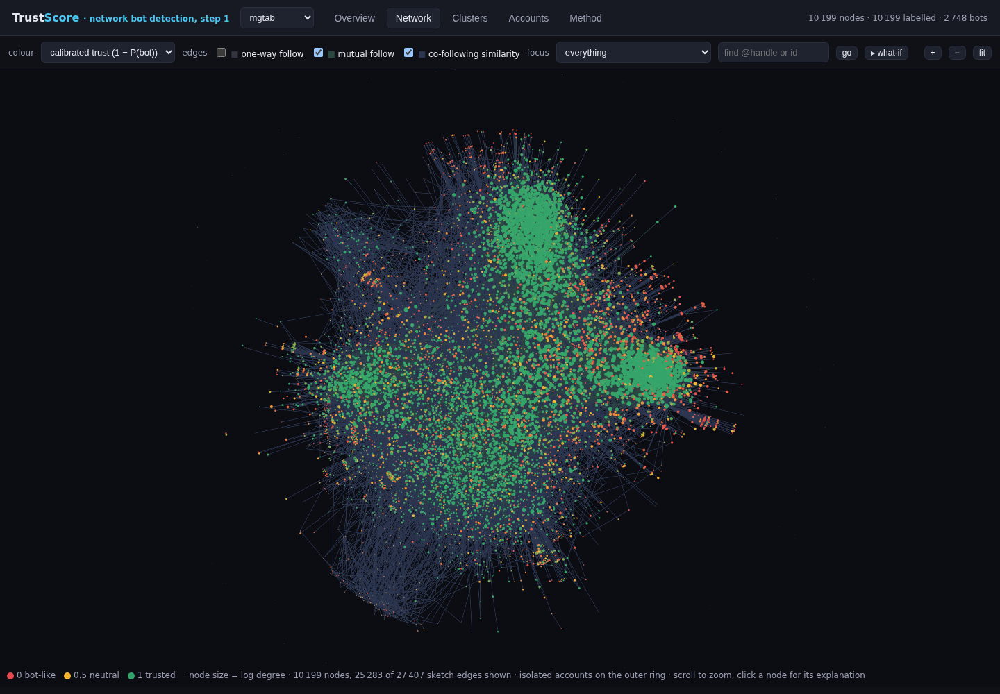
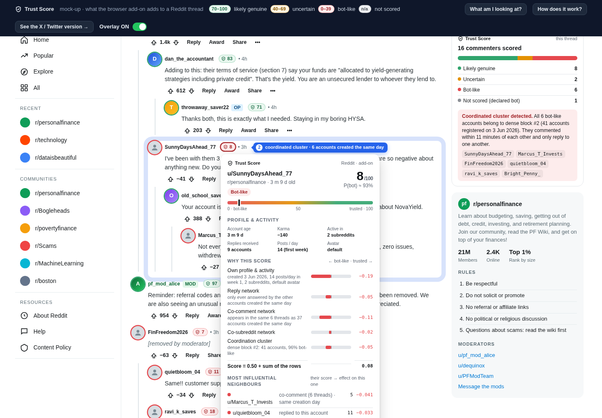

# Trust Score — step 1: network-based bot detection on open data

A **trust score** for social-media accounts that judges the *source* (profile metadata, position in the
follow/interaction graph, membership in coordinated clusters) rather than the content it posts.
Step 1 of 3: find bots in open, labelled network datasets, define and validate the score formula, and
expose everything in a web dashboard. Design choices, approximations and hard-coded values are documented in
[`docs/DESIGN.md`](docs/DESIGN.md) (2 pages).

```
backend/    Python package `trustscore` (loaders, features, local model, propagation, clusters, evaluation, FastAPI)
frontend/   React + TypeScript dashboard (sigma.js network explorer, recharts)
data/raw/   downloaded datasets (cresci-2015 from the Bot Repository, MGTAB from GitHub/Google Drive)
data/processed/<dataset>/   pipeline artifacts served by the API
docs/       DESIGN.md (+ PDF)
mockups/    static browser add-on mock-ups (Reddit, X/Twitter)
bluesky-addon/  live Chrome add-on for bsky.app (BFS crawler + scoring server on :8010, see bluesky-addon/README.md)
screenshots/ images used in this README
```

## Quick start

```bash
# 1. backend environment (uv or plain venv)
cd backend && uv venv --python 3.10 .venv && uv pip install --python .venv/bin/python -e .

# 2. datasets (already downloaded in data/raw; see docs for sources)
#    cresci-2015: https://botometer.osome.iu.edu/bot-repository/datasets/cresci-2015/cresci-2015.csv.tar.gz
#    MGTAB:       https://github.com/GraphDetec/MGTAB (Google Drive link in the README)

# 3. run the pipeline (features -> local model -> propagation -> clusters -> evaluation -> artifacts)
.venv/bin/python scripts/run_pipeline.py cresci-2015      # ~5-10 min, add --skip-sweeps for ~1 min
.venv/bin/python scripts/run_pipeline.py mgtab

# 4. API + dashboard
cd ../frontend && npm install && npm run build           # builds into frontend/dist (served by the API)
cd ../backend && .venv/bin/python scripts/serve.py 8000   # http://127.0.0.1:8000
# (development: `npm run dev` in frontend/ proxies /api to the backend on :8000)

# tests
cd backend && .venv/bin/python -m pytest -q
```

## What the score is

For every account `v`, with `q_v` its prior evidence of being a bot (±½ for labelled seeds, `λ·(p_local − ½)`
from a Random-Forest profile/structure model otherwise) and `P` a row-stochastic matrix over typed,
hub-damped edge channels (mutual follow, follower→followee, followee→follower, mentions, replies, …):

```
r = (1 − α)·q + α·P·r          (unique fixed point, |r| ≤ ½)
trust(v) = ½ − r_v ∈ [0, 1]     (1 = trusted, 0 = bot-like)
```

Channel weights are estimated from the label homophily of seed–seed edges (blended with a hand-set prior).
The dashboard decomposes every score into prior + per-channel + per-neighbour terms, lists the local-model
feature contributions, and shows Leiden communities, dense co-following blocks and creation bursts.

## Screenshots

### Dashboard: metrics (Overview tab)

Out-of-fold ROC AUC / AP / F1 of the trust score against three baselines (local model only, propagation only,
raw uncalibrated trust), ROC curves, the score histogram by label, robustness sweeps (share of labelled seeds,
label noise), the most useful local features and the learned per-channel weights.



MGTAB is the harder, more recent dataset (every account labelled, bots mixed into the genuine population rather
than sitting in separate follower farms): out-of-fold AUC drops to 0.96 and propagation alone is close to useless,
so the score leans on the local model and the learned channel weights.



### Dashboard: network explorer (Network tab)

sigma.js view of the labelled accounts and their neighbourhood, coloured by calibrated trust (red = bot-like,
green = trusted). The three red blobs are the cresci-2015 fake-follower groups, the green mass the genuine
accounts; toggle edge channels, focus on a cluster, search a handle, or click a node for its score decomposition.



On MGTAB there are no separate bot blobs: bot-like accounts (red/amber) are scattered at the fringe of the genuine
communities, which is why the network alone cannot separate them.



### Browser add-on mock-up (step 3 preview)

Static, realistic fake of what the step-3 browser add-on will inject into a Reddit thread (an X/Twitter version
is included too): a trust badge next to every username, a popover that decomposes the score into own evidence,
per-channel network terms and cluster membership, and a side card summarising the page. Numbers are illustrative
but follow the real score's structure. Details in [`mockups/README.md`](mockups/README.md).



To see it, serve the `mockups/` folder (no build step) and open the landing page, which links to both mock-ups and
has a guide with "Show me" buttons for the four example accounts:

```bash
python3 -m http.server 8765 --directory mockups     # then open http://127.0.0.1:8765/index.html
```

Opening `mockups/index.html` directly in a browser (file://) works too.
